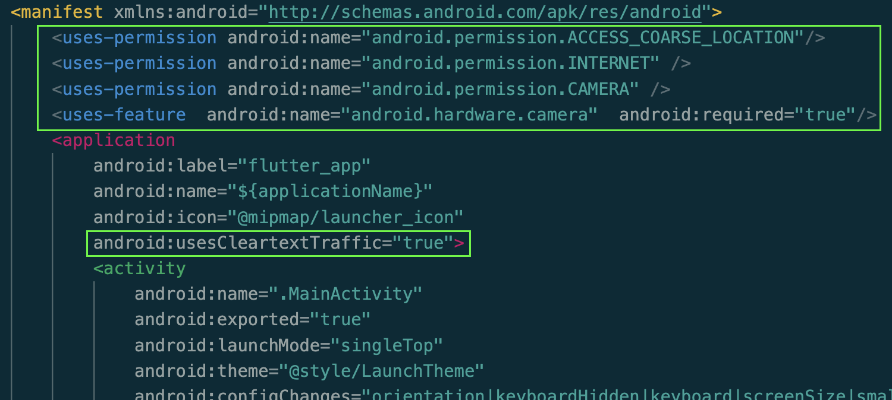

# Invasive Plants App Deployment Guide

<b>Note: This is the deployment guide for the Mobile App of the Invasive Plants Project. Please ensure you have deployed the [AWS backend](https://github.com/UBC-CIC/InvasivePlants/blob/main/docs/DeploymentGuide.md) before proceeding with this guide.</b>

| Index                                                      | Description                                               |
|:-----------------------------------------------------------|:----------------------------------------------------------| 
| [Dependencies](#Dependencies)                              | Required services and tools for deployment                                 |
| [Clone the Repository](#clone-the-repository)              | How to clone this repository                              |
| [Connect the App to the Backend](#connect-the-app-to-the-backend)| Connect the app to the backend of this project           |
| [Deploy to TestFlight](#deploy-to-testflight)              | Deploy your app to TestFlight for testers to use          |
| [Deploy to Android](#deploy-to-android)              | Deploy your app to the Android platform         |


## Dependencies
The full list of steps to create and deploy a new Flutter application from scratch can be found [here](https://docs.flutter.dev/get-started/install/macos).

 Below are the required tools and services to deploy the existing project from the GitHub repository:
 - [Apple Developer Account enrolled in the Apple Developer Program](https://developer.apple.com/programs/enroll/)
- [GitHub Account](https://github.com/)
- [Git](https://git-scm.com/) v2.14.1 or later
- [Flutter](https://docs.flutter.dev/get-started/install/macos#get-sdk) version 3.3 or higher
- IDE of your choice (For development we recommend: [VS Code](https://docs.flutter.dev/tools/vs-code))
- [Xcode](https://docs.flutter.dev/get-started/install/macos#install-xcode)
- [CocoaPods](https://guides.cocoapods.org/using/getting-started.html#installation) - Additionally, if you are installing on an Apple Silicon Mac, follow step 2 of [this section](https://docs.flutter.dev/get-started/install/macos#deploy-to-ios-devices)
- Pl@ntNet API
  -  Note: If you are a non-profit organization, contact [Pl@ntNet](https://my.plantnet.org/contact) to request a non-profit account. This way, you can have more than 500 identifications per day.
     - Otherwise, create a Pl@ntNet account [here](https://my.plantnet.org/signup)
     - For plan pricing, choose the free plan, which offers 500 identifications a day.


## Clone the Repository

First, clone the github repository onto your machine. To do this:
1. Create an empty folder to contain the code.
2. Open terminal and **cd** into the newly created folder.
3. Clone the github repository by running the following command:
```
git clone https://github.com/UBC-CIC/InvasivePlantsFlutter.git
```

The code should now be copied into the new folder.


In terminal, **cd** into root directory of the project folder by running the following command from the newly created folder's directory:
```
cd InvasivePlantsFlutter/
```
And to open the project in VS Code, run:
```
code .
```

## Connect the App to the Backend
### Set up Environment variables
Create a file called `.env` at the root level:

```
BASE_API_URL=""
API_KEY=""
COGNITO_REGION=""
COGNITO_POOL_ID=""
COGNITO_APP_CLIENT_ID=""
PLANTNET_API_KEY=""
```

After backend deployment is completed, look for the values here:

**API Gateway Console**


To get `"BASE_API_URL"`:
1. Go to API Gateway in the AWS Console and click on the project's API
2. Go to `Stages` and look for `Invoke URL`

To get `"API_KEY"`:
1. Go to `API Keys`
2. Look for key with the name `InvasivePlantsCustomizedAPIKey` or something similiar

**Cognito Console**


For `"COGNITO_REGION"`, enter `ca-central-1`.

To get `"COGNITO_POOL_ID"`:
1. Copy the `User Pool ID` of your user pool.

To get `"COGNITO_APP_CLIENT_ID"`:
1. Click into your user pool.
2. Navigate to the `App Integration` tab.
3. Scroll to the bottom and the client ID should be on the right.

**Pl@ntNet API Console**

To get `"PLANTNET_API_KEY"`:
1. Log in to your Pl@ntNet account [here](https://my.plantnet.org/login)
2. Navigate to the "Settings" section of your dashboard. 
3. Find the "Private API key" and enter that as your `"PLANTNET_API_KEY"`.
   

To run the app, use the command below:
```
flutter run 
```


## Deploy to TestFlight

To deploy your app to TestFlight, you must first register your app on App Store Connect.

The official guide to register your app can be found [here](https://docs.flutter.dev/deployment/ios#register-your-app-on-app-store-connect).


### Register a Bundle ID
1. To get started, sign in to [App Store Connect](https://appstoreconnect.apple.com/) with your Apple Developer account and open the [Identifiers Page](https://developer.apple.com/account/resources/identifiers/list).
2. Click **+** to create a new Bundle ID.
3. Select **App ID > App**
4. Enter a description (name for the Bundle ID) and an **Explicit** unique Bundle Id (e.g. **com.[organization name].InvasivePlantsApp**)
5. Leave the **App Services** as default and click **Continue>Register**

### Create an application record on App Store Connect
1. Now, in the [My Apps](https://appstoreconnect.apple.com/apps) page of App Store Connect, click **+** in the top left corner and select **New App**
2. Select **iOS** under **Platforms**
3. Enter a name for the app (e.g. **Invasive Plants App**)
4. Select the **Bundle ID** you have just created
5. Enter a unique ID for your app under **SKU** (e.g. **com.[organization name].InvasivePlantsApp**)
6. Select **Full Access** for **User Access** and click **Create**

### Beta Test Information
To start testing with TestFlight, fill out the **Beta App Information**  in the `General Information > Test Information` page of your app in App Store Connect.


### Update Xcode project settings
For an official guide, please view the **Update Xcode project settings** section of the page found [here](https://docs.flutter.dev/deployment/ios#review-xcode-project-settings).

1. Navigate to your project settings by running the following command from the root directory of your project
```
open ios/Runner.xcworkspace
```
1. Select the **Runner** with the App Store Connect icon in the Xcode navigator
2. In the **General** tab, choose a display name for the app
3. Under **Minimum Deployments**, ensure it is set to iOS 13.0
4. Head to the **Signing & Capabilities** tab and sign in with your Apple Developer account if have not done so already
5. Please **ENTER and VERIFY** the **Bundle Identifier** matches with the Bundle Id created in App Store Connect
6. In the **Signing & Capabilities** tab, ensure **Automatically manage signing** is checked and Team is set to the account/team associated with your Apple Developer account. Under Bundle Identifier, check that the Bundle Id matches with the Bundle Id created in App Store Connect

### Create a Build
1. In Xcode, in the General tab under Identity, check that the Version number is set to 1.0.0 and the Build number is set to 1 **for your first deployment**. For future deployments, increment the Version number and reset the Build number for major updates (e.g. 1.0.1+1). For minor updates, incrementing just the Build number is sufficient (e.g. 1.0.0+2). 
2. In your IDE, open the **pubspec.yaml** file located in the root directory of your project. Set the version and build number located near the top of the file to match with the version and build number of the current deployment and save the file:
```yaml
version: 1.0.0+1
```
3. In Xcode, set the Target to be: `Runner > Any iOS Device`
4. From the root directory of your project in **Terminal**, run:
```
flutter build ios --release
```
1. Once the Xcode build is complete, select `Product>Archive` in the Xcode menu bar. Wait for the archive to complete.
2. Once the archive has completed, a window should appear showing all of your archives. Select the most recent archive and click `Distribute App`
3. Select `App Store Connect > Upload > Strip Swift Symbols + Upload your app's symbols + Manage Version and Build Number > Automatically manage signing > Upload`

### Deploy to TestFlight

1. Once the Xcode upload is complete, navigate to your app page in App Store Connect. Under `Builds > iOS`, there should be a list of builds uploaded from Xcode. Builds may take a few minutes to appear here. 
2. Once the uploaded build appears, click on it, fill in the Test Details, and **add Testers by their Apple ID**
3. Once a tester is added, the app should be automatically submitted for review. The reviewing process could take a few days to process.
4. Once the build is processed, testers will receive a code in their email for TestFlight.
5. Testers can then install TestFlight from the Apple App Store on an iPhone running iOS 13.0 or later and sign in with their Apple ID. 
6. In TestFlight, testers can press the `Redeem` button and enter the TestFlight code from their email. The app should then appear in TestFlight under Apps and testers will be able to install the build.
7. Builds uploaded to TestFlight have a lifespan of 90 days and will expire after that. To create another build of the app to upload to TestFlight after the 90 day period, please follow the steps above to [create another build](#create-a-build) and [upload to TestFlight](#deploy-to-testflight-1).

## Deploy to Android

Make sure you have **[Android Studio 2023.1 (Hedgehog)](https://developer.android.com/studio/install)** or later installed for running Android Emulators. Install the **[Flutter SDK](https://docs.flutter.dev/get-started/install/macos/mobile-android#install-the-flutter-sdk)** (if you haven’t already)

1. Follow [these steps](https://docs.flutter.dev/get-started/install/macos/mobile-android?tab=virtual#configure-android-development) to configure Android development, which includes:
   - Configuring the Android toolchain in Android Studio
   - Configuring your target Android device

2. Check that you have the development setup done correctly by using the command `flutter doctor`. You should see an output like this:

      ```
      Doctor summary (to see all details, run flutter doctor -v):
      [✓] Flutter (Channel stable, 3.19.0, on macOS A.B chipset, locale en)
      [✓] Android toolchain - develop for Android devices (Android SDK version 34.0.0)
      [!] Chrome - develop for the web
      [!] Xcode - develop for iOS and macOS (Xcode not installed)
      [✓] Android Studio (version 2023.1 (Hedgehog) or later)
      [✓] VS Code (version 1.86)
      [✓] Connected device (1 available)
      [✓] Network resources

      ! Doctor found issues in 2 categories.
      ```


**Running The Flutter App**
   - First, start your emulator in Android Studio
   - Then select your emulator as the device in VS Code
   - Use the command `flutter run`
     - this also generates an apk file, which can be used for running the app on physical devices


If your app makes HTTP requests or uses the phone’s camera, location, etc., modify your AndroidManifest.xml file at `/android/app/src/debug/AndroidManifest.xml`:
   - For HTTP, add these two lines:
     ```xml
     <uses-permission android:name="android.permission.INTERNET" />
     android:usesCleartextTraffic="true"
     ```
   - For Camera:
     ```xml
     <uses-permission android:name="android.permission.CAMERA" />
     <uses-feature android:name="android.hardware.camera" android:required="true" />
     ```
   - For other permissions like location, add them like this:
     ```xml
     <uses-permission android:name="android.permission.ACCESS_COARSE_LOCATION"/>
     ```

Example of what it looks like:


If you make any changes to the manifest file, make sure you run the commands:
   - `flutter clean`
   - `flutter pub get`

before running your app again.

**To Test on a Physical Android device:**
   - Connect your Android device to your computer.
   - Run the command: `flutter install`
     - If necessary, locate the APK file generated in `/build/app/outputs/flutter-apk/app-debug.apk`.


**To deploy for internal testing on the Google Play Console:**

   - Create a [developer account ](https://play.google.com/console/u/0/signup)
   - Set Up [Internal Testing](https://play.google.com/console/about/internal-testing/) on Google Play Console:
     - Go to the Google Play Console.
     - Create a new project if you haven't already.
     - In the left sidebar, go to "Internal testing."
     - Upload the APK generated earlier.
     - Add testers by email address. Testers will receive an invitation to test the app.

   - Download on Android Device:
     - Testers can download the app on their Android devices by joining the internal testing program. They will receive an email with instructions on how to download the app from the Google Play Store.
