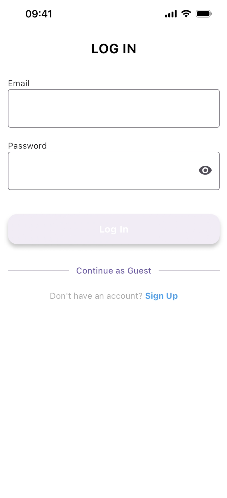
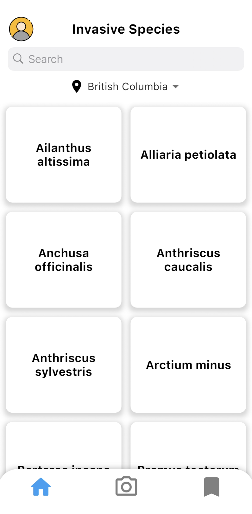
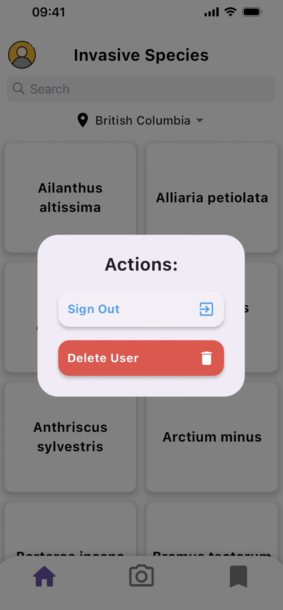
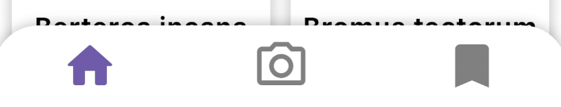
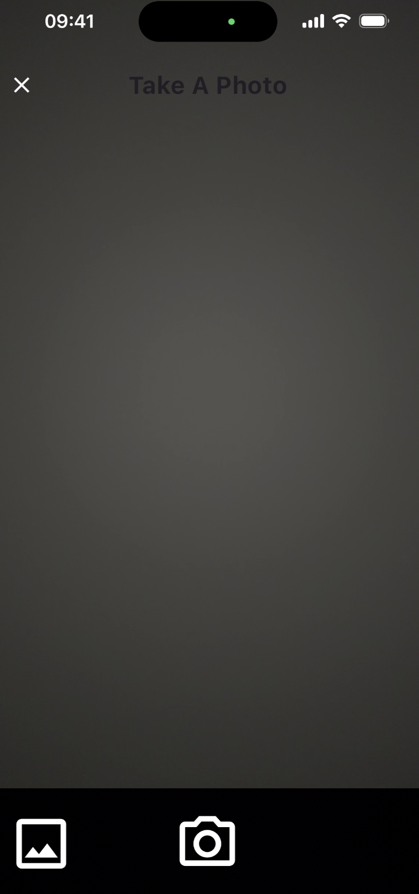
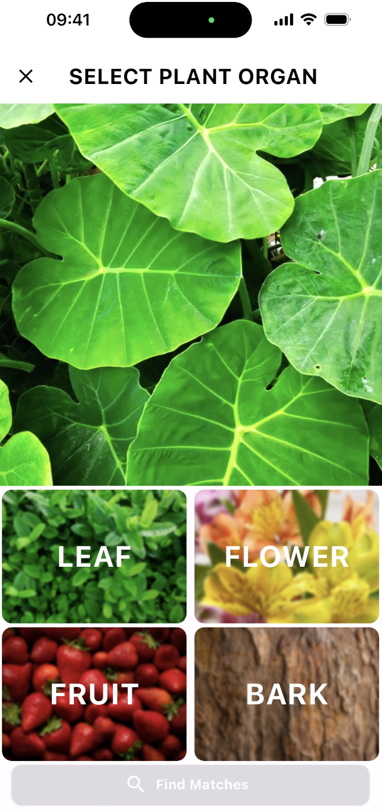
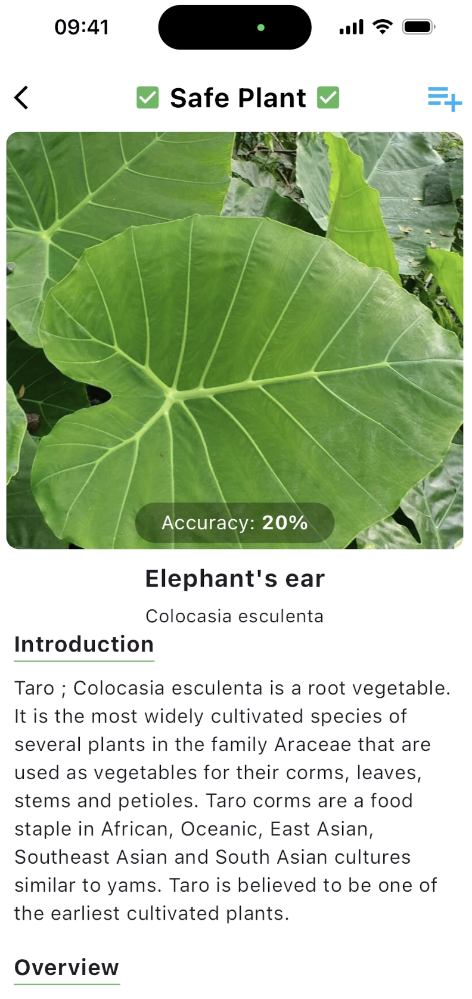
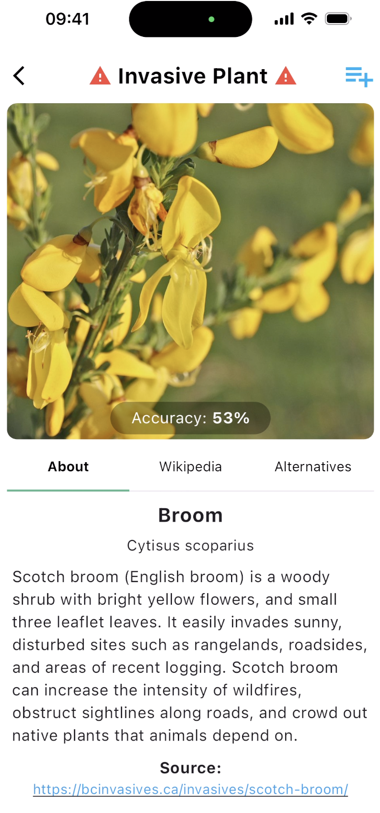
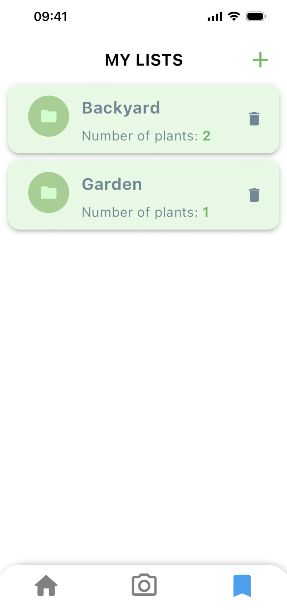
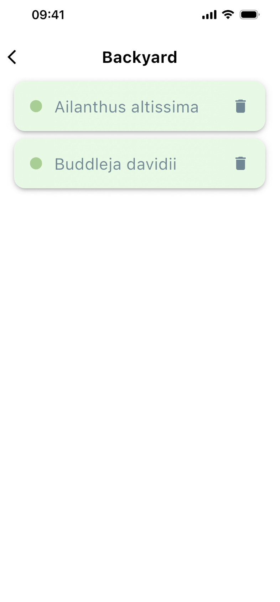

# Invasive Plants App User Guide

This Invasive Plants App currently allows users to identify invasive plants in two Canadian provinces - British Columbia and Ontario - and suggests alternative non-invasive plants to plant instead.

| Index                                         | Description                                                                            |
| :-------------------------------------------- | :------------------------------------------------------------------------------------- |
| [Log in and Sign up](#log-in-and-sign-up)     | User log in or sign up to the app                                                      |
| [Home Page](#home-page)                       | Setting user location and browsing invasive species                                   |
| [Plant Identification](#plant-identification) | Taking/uploading photos, viewing plant matches, and understanding plant information |
| [Lists](#lists)                               | Creating and saving plants into lists                                                  |

## Log in and Sign up
Upon loading the app, it will request access to the user's location. This information is used to identify whether a plant is invasive or not in the user's specified location. Users can also choose to manually adjust their location at any time through the dropdown in the [home page](#home-page).

Next, the user can log in or sign up with their email. Signing up is only required if the user intends to save plants into custom [lists](#lists). Otherwise, the user can opt to `Continue as Guest`, which grants access to all other features without registration.

|   |   |
|---|---|
| | **Login Page**: The user enters their credentials. |
|  | **Signup Page**: For the sign-up process, after the user enters valid credentials, a 6-digit verification code is sent to their email. After entering the code correctly, they will be directed back to the login page. |

## Home Page

|   |   |
|---|---|
| | After logging in or continuing as guest, the user will be directed to the Home Page. This page displays all of the invasive plants that fall within the selected region, which the user has the option to change. The app currently supports invasive plants in British Columbia and Ontario. The user can scroll through and browse these plants or search up a specific invasive plant by scientific name. |
| | **Profile Icon**: Located at the top left corner of the Home Page, a profile icon can be pressed. If the user is already signed in, they will have the option to sign out or delete their account. Otherwise, clicking on this icon redirects the user to the login page. |

### Invasive Plant Info

After pressing an invasive plant on the home page, the user will be provided with [detailed information](#invasive) about the invasive species.

### Navbar

Each main page features a bottom navigation bar with three icons. The home icon brings the user to the [Home Page](#home-page), the camera icon to the [camera](#camera), and the save icon to the user's [lists](#lists).

## Plant Identification

The following section will explain how a user can identify plants:

### Camera
|   |   |
|---|---|
| | The app will first ask the user for camera, microphone, and image gallery (if they choose photos) permissions. The user can either take a photo of a plant or upload an existing photo for identification. |
 | Next, the user can select the part of the plant they've photographed, choosing from the plant organs - leaf, flower, fruit, and bark. Clicking on the `Find Matches` button will direct them to the identification result. |

### Plant matches
The user will be provided with the best matching result for the identified species. Matches are marked as invasive or non-invasive given the user's location. Additionally, the user can choose to save the plant to a [list](#lists) by clicking on the save icon on the top-right of the page.

#### Non-invasive
|   |   |
|---|---|
| | If the species is non-invasive, the match preview will provide the plant's scientific name, common name, an accuracy score, a plant image, and a scrollable list of information about the plant provided through Wikipedia. |

#### Invasive

|   |   |
|---|---|
| | If the result is invasive, there are three tabs of information shown: About, Wikipedia, and Alternatives. The "About" tab shows a basic summary of the plant from the official invasive plants page of the province. The "Wikipedia" tab shows the information from Wikipedia. And the "Alternatives" Tab displays a list of alternative species to plant instead (if there exists such species).   |

## Lists

|   |   |
|---|---|
| | To access the lists feature, users are required to be [logged in](#log-in-and-sign-up). This functionality allows users to create personalized plant lists for better organization and convenient future access of plant information. Users can create as many lists as they would like, and delete them as well. |
 | Each list will display the saved species through their scientific names. Pressing on any of these species will display some basic information of each species. Users can only delete species from their lists on this page.  |
